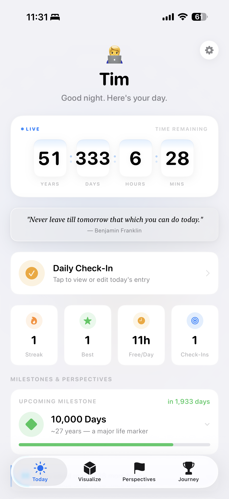
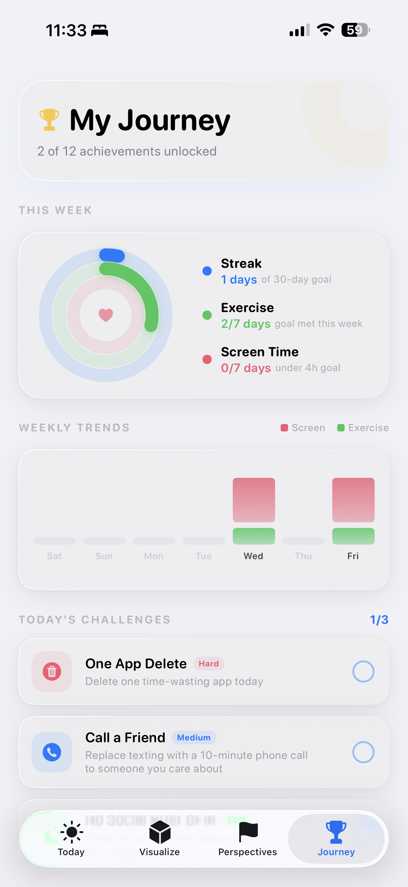
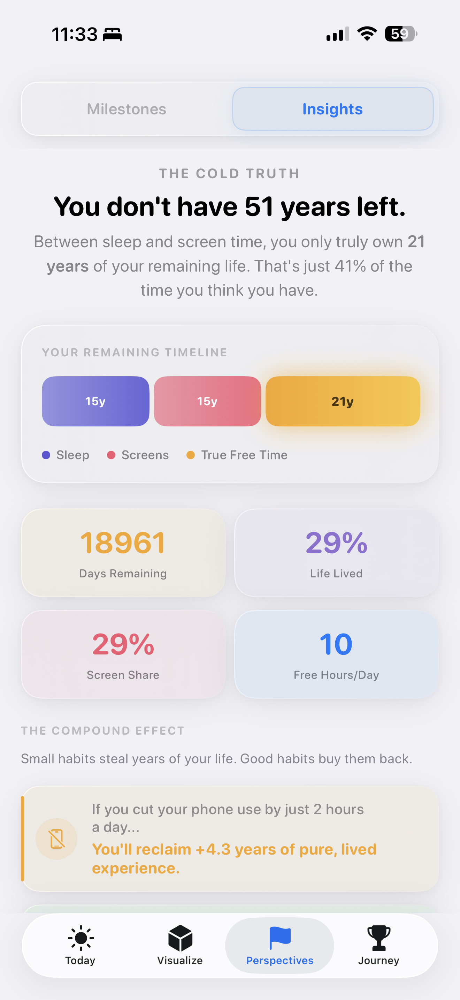

# TimeView

<p align="center">
  
</p>

<h3 align="center">Make your time tangible.</h3>

<p align="center">
  <strong>TimeView</strong> is a beautifully crafted iOS Apple App Playground that transforms the abstract concept of "life" into a tangible, 3D experience. Built entirely native with SwiftUI and SceneKit, TimeView forces you to confront the reality of how much time you truly have left—and how much of it you're losing to screens.
</p>

<p align="center">
  
</p>

---

## 🌟 Vision

Digital clocks are deceptive. They reset every midnight, tricking us into thinking time is an infinite loop. But time isn't a loop; it's a finite, non-renewable resource. 

TimeView was inspired by a moment of realization after staring at a 4-hour daily screen time report. It takes the abstract concept of your lifespan and turns it into physical 3D blocks you can orbit and explore. By seeing your "lived" days stacked against your "remaining" time, it changes the way you feel about the next hour. It’s a meditative wake-up call wrapped in a premium Apple-native aesthetic.

## ✨ Features

- **The Life Cube (3D Visualization):** A fully interactive SceneKit environment where every solid cube represents roughly 27 days of your life. Orbit, zoom, and tap nodes to explore your lived days, screen time, sleep, and true free time.
- **Glassmorphic UI:** A meticulously designed Apple-native interface featuring ultra-thin frosted glass cards, dynamic typography, and a vibrant iOS semantic color palette.
- **My Journey Dashboard:** Meaningful progress tracking with Apple Fitness-style activity rings, offline weekly trend charts, and daily intentionality challenges.
- **Multisensory Experience:** Integrated `CoreHaptics` and `AVFoundation` provide tactile pulses and ambient soundscapes that react as your timeline assembles.
- **100% Native & Offline:** Built completely in Swift with zero third-party dependencies. All data is securely persisted on-device using `@AppStorage`.

## 📸 Screenshots

<p align="center">
  
  &nbsp;&nbsp;&nbsp;&nbsp;
  
  &nbsp;&nbsp;&nbsp;&nbsp;
  
  &nbsp;&nbsp;&nbsp;&nbsp;
  
</p>

## 🛠 Technology Stack

- **SwiftUI:** For the fluid, responsive, and highly-styled glassmorphic user interface.
- **SceneKit:** For rendering the high-performance 3D Life Cube with physically-based rendering (PBR), deferred shadows, and alpha-blended particle effects.
- **Swift Charts:** For dynamic, native data visualization in the Perspectives and Journey tabs.
- **CoreHaptics & AVFoundation:** For a deeply accessible, multi-sensory experience that goes beyond the screen.
- **Swift 6 Concurrency:** Utilizing modern `@MainActor` isolation and `Task` groups for smooth asset loading and animations.

## 🚀 Getting Started

TimeView is built as a Swift Playground App (`.swiftpm`), meaning it runs flawlessly on both macOS (Xcode) and iPadOS (Swift Playgrounds).

1. Clone the repository:
   ```bash
   git clone https://github.com/anishkumar/TimeView.swiftpm.git
   ```
2. **On Mac:** Double-click the `TimeView.swiftpm` package to open it directly in Xcode. 
3. **On iPad:** Drop the `.swiftpm` file into the Swift Playgrounds folder in iCloud Drive to run it directly on your device.
4. Hit **Run (⌘R)**.

> **Note on App Icon:** The custom 3D glass cube app icon is located in `Assets.xcassets`. Ensure you have "Automatically manage signing" enabled in Xcode to deploy to a physical iPhone.

## 🎨 Design Philosophy

Accessibility and aesthetic excellence were the core pillars of development. The app utilizes:
- **SF Symbols** for semantic, VoiceOver-ready iconography
- **Dynamic Type** support to ensure deep UI accessibility
- **System Colors** (`.label`, `.secondarySystemGroupedBackground`) for perfect light/dark mode contrast
- **Reduce Motion** compliant `.spring()` physics for comfortable transitions

## 📄 License

This project is licensed under the MIT License - see the LICENSE file for details. Built natively using Apple Developer tools.
